# The Six Nations City Guide

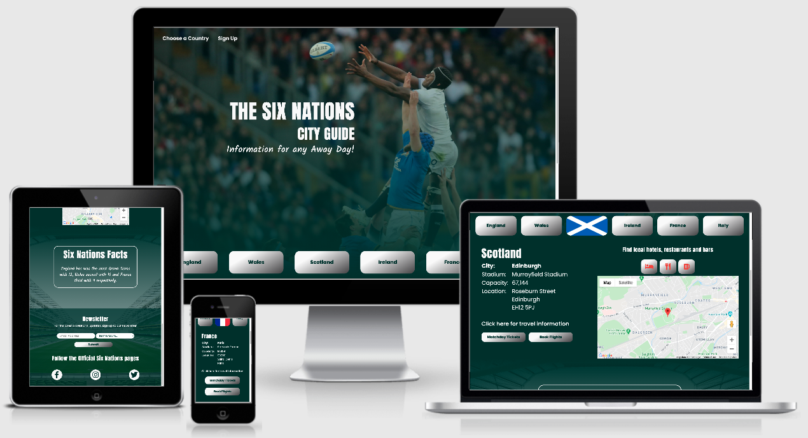

[&#127945;  &nbsp; **View Live Website**  &nbsp; &#127945;](https://olihickie.github.io/six-nations/)

[&#127967;  &nbsp; **View GitHub Repository** &nbsp;&#127967;](https://github.com/OliHickie/six-nations)

This website is designed to help sports fans travelling to Six Nations rugby games. The tournament, which is held annually, involves six European teams who each host two or three games a year. This city guide is designed for supporters who are planning on visiting a city and will help them find local amenities, as well as the stadium itself, along with travel information and ticket purchasing links. 

 # Contents

1) [User Experience](#user-experience-(ux))
2) [Features](#features)
3) [Technologies](#technologies)
4) [Testing](#testing)
5) [Deployment](#deployment)
6) [Credits](#credits)

# User Experience (UX)

## User Stories
* As a visitor to the website, I want to:
    - Navigate around the website with ease.
    - Find and select the country/city I am planning to visit.
    - Locate country specific information which will include name and location of the stadium and links to travel information. 
    - Easy access to match day ticket bookings and flight searches.
    - View a map of the local area to the relevant stadium. 
    - Be able to view and find local amenitites, including accommodation and establishments to eat and drink near the stadium. 
    - Be able to sign up for relevant news and information to do with the Six Nations tournament. 
    - Access links to the official Six Nations social media pages.
    - View all information clearly and access it easily when I return to the website. 

## Design

The site's main goal is to provide the user with information and for the user to be able to access the information quickly.

### Color Scheme
 The main color throughout the site is a dark green (Hex code: [#00302b](https://www.google.com/search?q=%2300302b&oq=%2300302b&aqs=chrome.0.69i59.4496j0j9&sourceid=chrome&ie=UTF-8)) as green is often associated with the outdoors. This has been used as contrast against the white text to ensure the user can read the text easily and to ensure the  information stands out on the page. I have kept the color scheme quite simple as I will use flags and a Google Map on the site, which will bring more color to the site. All buttons on the site are colored in the same way using a slightly off-white color with a touch of darkness to add a bit of texture. Red colored icons feature above the map to visually link the icons to the markers associated to them on the map. 

### Typography

The site uses three main fonts; [Anton](https://fonts.google.com/specimen/Anton?preview.text_type=custom), [Poppins](https://fonts.google.com/specimen/Poppins?preview.text_type=custom) and [Kalam](https://fonts.google.com/specimen/Kalam?preview.text_type=custom), all of which are taken from the Google Fonts library. Poppins is used for the main text of the website as it is clear and easy to read. I have used Anton for the headings as it is a bold, strong font. Kalam is used for the tagline and in the fact box below the map section. This has a more conversational feel and look to it, visually separating the fact box from the city guide information.

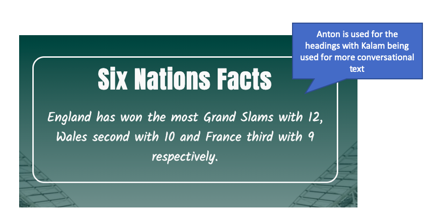
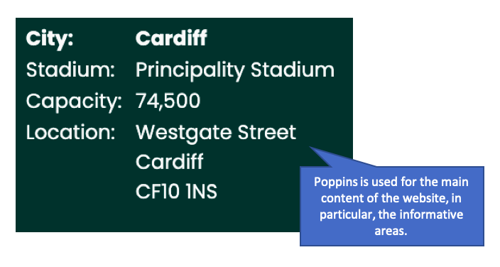

### Imagery 

Imagery is used on the site to add color and create an appealing backdrop. The main header image is an action shot from a rugby game. This image is adapted slightly using a color overlay getting denser towards the bottom. An image of the Aviva stadium (Ireland) is used as the backdrop for the lower part of the website, again using an overlay but mirroring the direction of opacity. The other images used are of the nation's flags; these images serve the purpose of indicating which country is currently selected and whose information is being displayed below. 

### Wireframes

The wireframes below were created using Balsamiq and display how the site would appear in a basic form across three different screen sizes. 

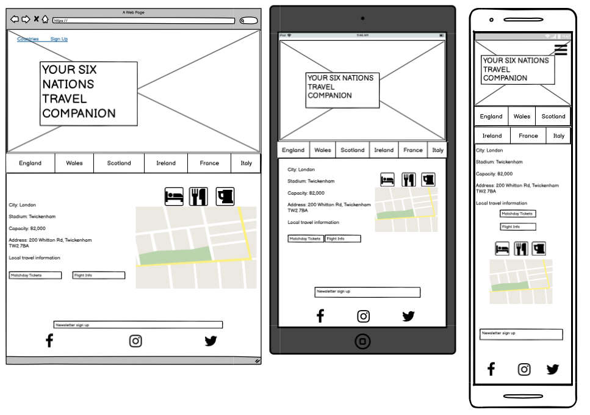

Some changes were made to the design of the site after completion of the wireframes. 
 - An extra background image was included for the bottom half of the page to be more appealing and offer a better UX than just having a plain color. 
 - A heading was added to the map section to ensure the user understands what the map is there for and to help with selecting the hotel, bar or restaurants. 
 - A box has been added below the map and information section which cycles through a number of facts about the tournament. This adds another element of information that the site offers the user. 
 - The sign-up form for the newsletter has moved down into the footer (for larger screens) as this offered a better UX in comparison to stacking the sign-up form on top of the social media icons. 

# Features

 - **Navbar** The Navbar is situated at the top of the page, however this only requires two options as the buttons situated at the bottom of the window allow the user to change between countries. The navbar allows the user to move quickly down to the Country selectors or, to the bottom of the page, where the user can sign up to the newsletter. When viewing the website on a smaller screen the navbar collapses into a button that, when pressed, will display the two options. This navbar feature was taken from Bootstrap. 
 - **Header** The heading, which is displayed in the centre of the landing window, is big and bold and describes the functionality of the site. 
 - **Country Selectors** At the bottom of the window (when the page is loaded) are six country selectors, one for each nation that hosts games during the tournament. I wanted these to be visible as soon as the page loaded. When an selector is chosen, the window will automatically scroll down (if the content isn't already in view) to display facts and information specific to the chosen nation. The selector, once chosen, also displays the nations flag to display that this button is active. When the selector is clicked for a second time, or another country is chosen, the previous selector returns to its original state and the related information is hidden. 
 - **Information section** When a country is selected, the information that is displayed below the selector is specific to that country and is relevant and helpful for any visitor travelling to an away day. The information includes the name of the city and the stadium, the capacity of the stadium and address. The address links to an external google map so the user can enter directions. Other options available are links to various helpful sites, including travel information and the purchasing of matchday tickets and flight booking. 
 - **Map section** The map section is either situated underneath the city information in smaller screens, or to the right hand side on larger screens. This includes three selectors and a Google map. When the country is first selected, the google map initially displays a marker for the location of the stadium used for by the country's national rugby team. There are three selectors above the map which, once clicked, will display local amenities to the stadium; these include hotels, restaurants and bars. If the user clicks on any of the markers, the map will display an info window and show the name of the venue. The selectors have an icon in them to represent the type of venue they will display, but I have also included a Bootstrap tooltip to back up the icon. 
 - **Fact box** Below the map section there is a box which cycles through a number of facts related to the Six Nations tournament. These facts fade into view and are visible for 9 seconds before moving on to the next one. The facts will continue to cycle while the page is open and once reloaded, the facts will return back to the beginning of the cycle. 
 - **Footer** At the bottom of the page is the footer, which is broken down into two sections. The first is a sign-up section for a newsletter which is related to the website. This requires an email address and the user can optionally add which country they follow for more targeted content. On submission of the form, the information is then sent to the site owner using EmailJS and a tick is visible next to the submit button for a short period to let the user know the information has been sent successfully. Alternatively, if there is a problem sending the form, a cross will appear next to the submit button. If the form is sent successfully, then the form is reset in case the user would like to add another contact email. 
 The other section of the footer includes social media icons which relate to the official Six Nations social media pages. 

 ### Future Features
 Going forward, I would like to include a section on the site for live results and league tables. I would also like to expand the site to include other rugby stadiums and other rugby competitions both domestic and international. 

# Technologies

## Languages

- HTML5
- CSS3
- Javascript (JQuery)

## Libraries, Frameworks and other Programmes

- **[Balsamiq](https://balsamiq.com/)** - This was used to create the wireframes to plan and design the site. 
- **[Git, GitPod and GitHub](https://github.com/)** - Git was used for version control, GitPod hosted the coding space before using GitHub to store the repository and launch the page on Git Pages.
- **[Bootstrap](https://getbootstrap.com/)** Bootstrap was used for various features across the site but most often for the layout and positioning of elements. I also used bootstrap to help produce a toggling navbar and to create the form in the footer.  
- **[Google Fonts](https://fonts.google.com/)** - This is where I retrieved the fonts used across the page. 
- **[Google Maps API](https://developers.google.com/maps/documentation/javascript/overview)** - I used the google maps API to embed a map into the site. Much of the code is taken from the related documentation pages. 
- **[Google Maps Places](https://developers.google.com/maps/documentation/javascript/places)** - This was used to show local places such as hotels, restaurants and bars. Much of the code is taken from the related documentation pages. 
- **[EmailJS](https://www.emailjs.com/)** - This site was used to send the information collected in the newsletter sign-up and send the information to the site owner. 
- **[Fotor Photo Editor](https://www.fotor.com/)** - This software was used to edit images for the page.
- **[Font Awesome](https://fontawesome.com/)** - I used icons taken from this website for the social media links in the footer, for icons to confirm or not whether the newsletter form was submitted successfully and for the buttons to select hotels, bars or restaurant.   
- **[Ting JPG](https://tinyjpg.com/)** This website was used to compress the large images to make them smaller and easier to load. 
- **[CSS Gradient](https://cssgradient.io/)** This site was used to create the color gradients used for the buttons. 

# Testing

## Functionality Testing

- **Navbar** 
    * When the user hovers over either of the items in the navbar with their cursor, the item is highlighted with a white background and the text changes to green. 

    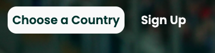

    * When the 'Choose a Country' item is selected, the window jumps down the page and the Country selectors are positioned at the top of the window. 
    * When the 'Sign Up' item is selected, the window jumps to the bottom of the page where the user can sign up to the newsletter. 
    * On smaller windows, the navbar collapses into a hamburger button which, when clicked, displays the two items in the navbar. 
- **Country Selectors** 
    * The country selectors are displayed at the bottom of the window, in a single row, or in two rows on smaller screens. 
    * When a country is selected (and the window is scrolled near the top of the page) the page will automatically scroll down to display the information. 
    * When a country is selected, the country's flag becomes visible to let the user know that this selector is active. The information and map related to the selected country is displayed below the selectors while it is active.
    * When a country is clicked for a second time, the country's flag disappears and the country's name returns. Also, the information and map related to the country is hidden from view. 
    * When another country is selected, the previously 'active' country's flag, information and map is hidden from view and replaced by the new selected country.
    * Countries can be easily removed and added depending on future teams in the tournament by simply editing the array and object in scripts.js.

    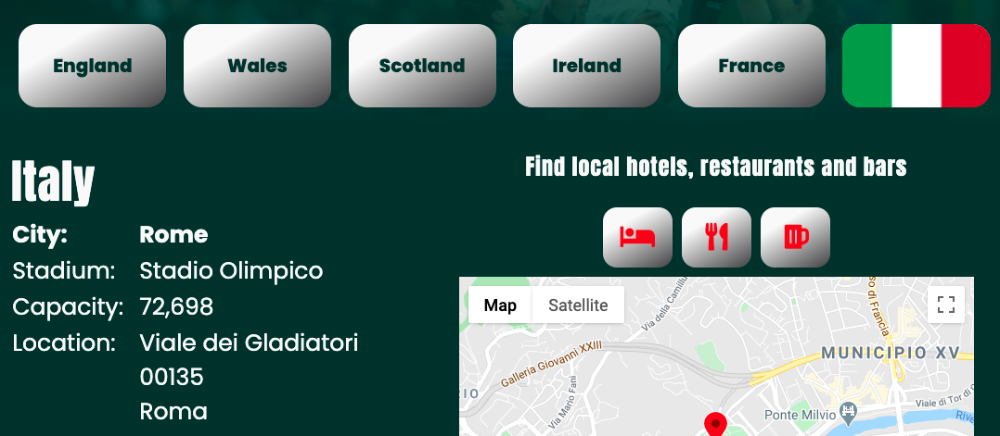
- **Country Information**
    * For each country, there is a set of information displayed and related links to various websites. When a country is selected, the style and look stay the same, however the content changes depending on what is selected. 
    * The location address for each country links to an external Google map. The 'travel information', 'matchday ticket' button and 'book flights' button all link to related external sites. 
- **Country Map**
    * The Google map for each country, when first displayed, shows the location of the stadium.
    * The three buttons located above the map remove any markers already visible on the map and in turn, replaces these markers with ones to represent the selected business type, whether hotels, restaurants or bars.
    * When any of the buttons are hovered over, a tooltip appears above with a written description for the business type and once clicked, the tooltip stays visible to show that button is active.  

    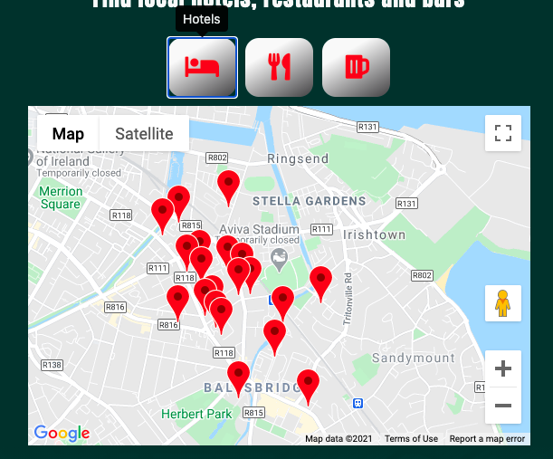

    * Each marker shows the location of the venue and, when clicked, displays an info window with the name of the venue. If, and when, the user clicks on another marker, the previous info window disappears. 

     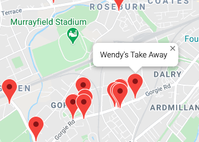

- **Fact Box** 
    * When the page is loaded the fact box begins its cycle. There are currently seven facts that fade in and out of view, staying visible for 9 seconds.
    * Facts can be added and removed easily by adding to, or deleting them from the related array in the scripts.js file. 
- **Newsletter Sign Up** 
    * The user can sign up to a newsletter by imputing their email address and clicking the submit button. 
    * If submitted successfully a small tick will appear for three seconds and the form will reset itself. 
    * Similarly, if unsuccessful an error message will appear. 

    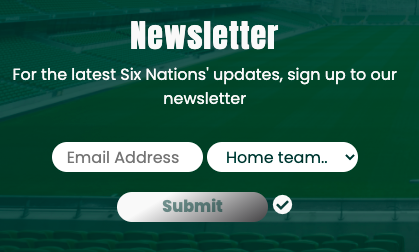
    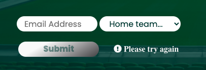

- **Social Media**
    * All social media links take the user to social pages in an external link. 

## Validation

-   [**HTML Validator**](https://validator.w3.org/) Running my index.html through the HTML validator through back a couple of warnings and zero errors. 
    - warning: the country selection section lacked a heading. I therefore added a h2 heading for screen readers only. 
    - warning: use of a h1 element for the fact box. I therefore changed the h1 to an h2 element. 
Following the changes above the HTML validator returned no errors or warnings. 

- [**CSS Validator**](https://jigsaw.w3.org/css-validator/) I validated my CSS at the linked site and it returned no errors.  

- [**Javascript Validator**](https://beautifytools.com/javascript-validator.php) I validated my scripts.js, maps.js and signup.js and it returned no errors. 

## Compatibility Testing
The site was regularly checked (using Chrome DevTools) for responsiveness across various screen sizes. Once the site had been completed, it was then checked on Safari and Chrome browsers, Apple and Samsung tablets and various mobile devices including Apple and Google. 

Below are some bugs that arose during the testing process:

- The background for the navbar was set to transparent to display the header image. However, this meant that when the toggler was implemented on smaller screens, the navigation links clashed with the background image. I therefore added a background using Javascript for when the toggler was clicked. 
- When testing with users, it became clear that not everybody understood what the icons represented above the map. This was the stage that the tooltips were added. 

## Lighthouse

I conducted tests using the Lighthouse feature on Chrome DevTools. Below are the results from the test. 
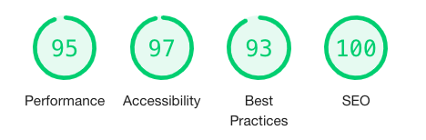

## Testing User Stories

* As a visitor to the website, I want to:

    - *Navigate around the website with ease.*

    The website is all condensed into one page which can display all of the information for each country in turn. The navbar and country selectors automatically scroll the page to the desired position for the user and what they have requested to see by clicking an option. 

    - *Find and select the country/city I am planning to visit.*

    The country selectors are clearly visible at the bottom of the page on loading and on selecting one, displays the relevant information. 

    - *Locate country specific information which will include name and location of the stadium and links to travel information.*

    On selecting the country, the relevant information becomes visible including the specific name and other local information. 

    - *Easy access to match day ticket bookings and flight searches.*

    Two buttons are located at the bottom of each information section which stand out against the other information. These offer external links to relevant pages with regards to flight booking and match day tickets. 

    - *View a map of the local area to the relevant stadium.* 

    On loading a certain country's information, a map also becomes visible offering the location of the stadium and its local area. 

    - *Be able to view and find local amenitites, including accommodation and establishments to eat and drink near the stadium*. 

    Above the map there are three buttons each referencing a different type of venue a supporter may want to visit on a match day, including bars, restaurants and local hotels. The color of the icons relates to the markers on the map. 

    - *Be able to sign up for relevant news and information to do with the Six Nations tournament.* 

    In the footer of the page, and easily accessible from the navbar, there is a sign-up form for the a Six Nations newsletter. The option is also available to select a certain team for targeted news and reports. 

    - *Access links to the official Six Nations social media pages.*

    In the footer section, there are three large social media icons which, when selected, take the user to the official six nations social media pages in an external page.

    - *View all information clearly and access it easily when I return to the website.*

    The information is all neatly spaced out across the page with lots of blank space so as not to seem overcrowded. It is quick and easy to access the information, which is the main function of the site. All links open in external pages so the user can keep the page open. 

# Deployment

The site was deployed using GitHub Pages using the following steps.

1. Log into GitHub.
2. Go to the site's [repository](https://github.com/OliHickie/six-nations).
3. In the submenu, click the settings tab and scroll down to the heading 'GitHub Pages'.
4. Change the source to the required branch and, when the page reloads, copy the link into your browser.

To clone the site follow the following steps.

1. Log into GitHub.
2. Go to the site's [repository](https://github.com/OliHickie/six-nations).
3. Next to the green 'Gitpod' button, click the drop down menu that says 'code'.
4. Copy the url provided.
5. Open the terminal in an environment you would like to use to clone the site and enter 'git clone' followed by the copied url. When you press enter, the code will be cloned.

# Credits

## Content, Media and Code

* The facts used about the Six Nations were taken from [here](https://www.ruck.co.uk/mind-blowing-facts-you-never-knew-about-the-six-nations/).
* The two background images were taken from [Shutterstock](https://www.shutterstock.com/home).
    - Image 1 - [The jumping ruigby players](https://www.shutterstock.com/image-photo/0402-stadio-olimpico-rome-italy-rbs-1019239000).
    - Image 2 - [Aviva Stadium](https://www.shutterstock.com/image-photo/dublin-june-10-empty-stadium-aviva-63908860).
* The flag images were taken from [GoSquared](https://www.gosquared.com/resources/flag-icons/).

* Much of the code used for the Google Map API was taken from the [Google Map documentation](https://developers.google.com/maps/documentation/javascript/overview)

I would like to give a huge thank you to my mentor Maranatha Ilesanmi for his patience, help and support with this project. I would also like to extend my gratitude to the Code Institute tutor team and Slack community for their words of wisdom. 